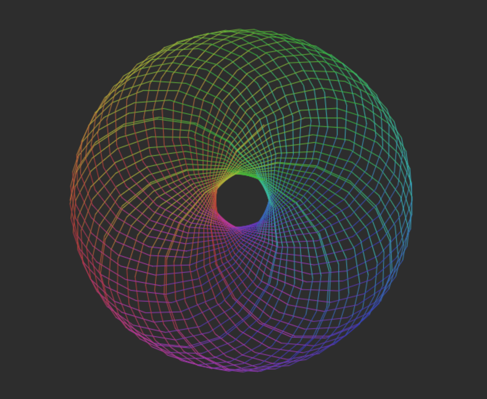

# Spirograph
  A recreation of the classic Spirograph - Current work in progress making some adjustments. UI to come!

 


## Change Log
  * Initial Commit - Basic formula found online.

## Run the example
  Requires Node v9.0 or greater

```bash
$ npm install
$ npm run dev & open http://localhost:2020
```

## License

[MIT]
